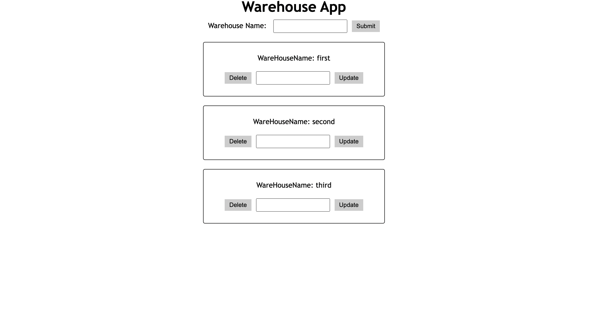
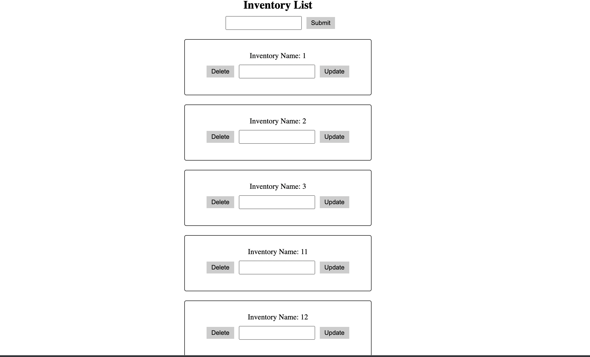

# Crud-App-MySql Project




## Tools
* React
* React Router Dom
* Axios
* MySQL

## Features
* You can add, delete and update warehouse
* You can add, delete and update inventory list on each warehouse

## Usage
```
cd client
npm install
npm start

cd server
npm install express
npm start
```